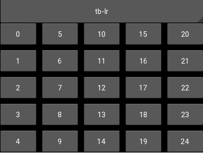
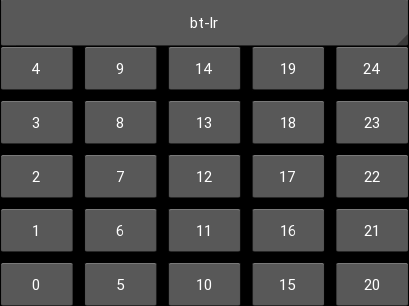
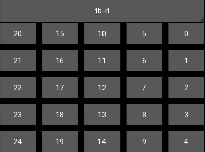
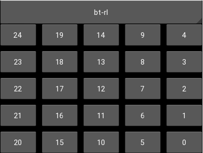
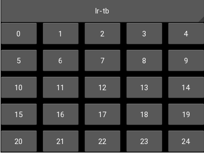
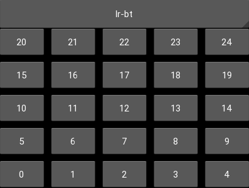
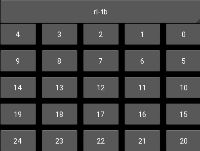
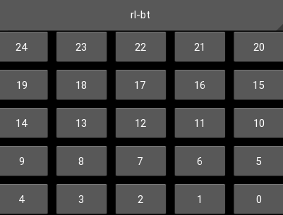
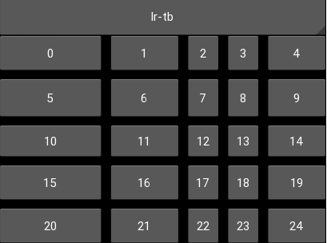

SplitterGrid
============

A GridLayout-like widget, that allows the user to manually change the relative
sizes of each collumn and row. If the widget is resized, the preferences will
be conserved relalively (a column resized to 10% of the total width will stay
10% of the total width). As with GridLayout, either a number column or a number
of rows must be set, if both are set, then `cols` is used.

It also allows setting the order of filling through the `orientation` property,
all the modes you could hope for are implemented:

tb-lr, top to bottom, left to right, which means the first column 
will be filled from top to bottom, then the second column, etc.

bt-lr: bottom to top, left to right

tb-rl: top to bottom, right to left

bt-rl, bottom to top, right to left

lr-tb: left to right, top to bottom

lr-bt: left to right, top to bottom

rl-tb: right to left, top to bottom

rl-bt: rigth to left, bottom to top

The margin between each cell can be dragged by the user, resizing the
corresponding row or column (or both, if you drag from an intersection).
`min_col_width` and `min_row_height` allowing to set constraints on user
interaction. On desktop, the mouse cursor is set to arrows indicating the
possibility of resizing when hovering a margin.

This layout doesn't use `size_hint` or `size_hint_min` and `size_hint_max`
properties of its children.

The module can be ran standalone and will display a basic demonstration of the
layout.

Contributing
------------

Check out our [contribution guide](CONTRIBUTING.md) and feel free to improve the flower.

License
-------

This software is released under the terms of the MIT License.
Please see the [LICENSE.txt](LICENSE.txt) file.

How to release
==============

See the garden [instructions](https://kivy-garden.github.io/#makingareleaseforyourflower) for how to make a new release.
